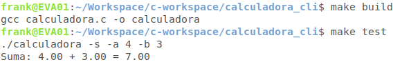
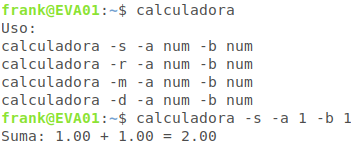

# Calculadora para la línea de comandos (CLI)

Una calculadora simple programada en **C** para realizar las operaciones aritméticas básicas a través de los parámetros de entrada.

## Ejecutar

<p align="center">
    
</p>

## Agregar la aplicación a la variable de entorno ($PATH) del usuario 

```
    sudo chmod +x calculadora

    sudo mv calculadora /usr/bin/ 
```

## Aplicación

<p align="center">
    
</p>